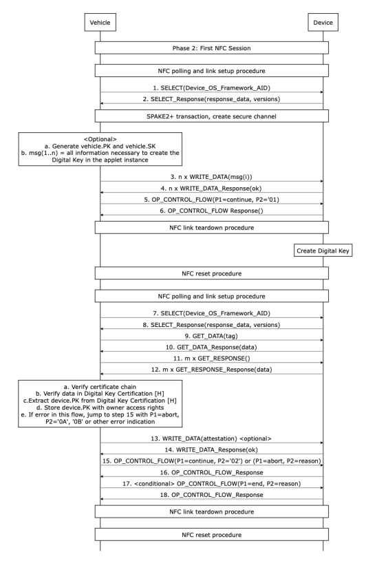
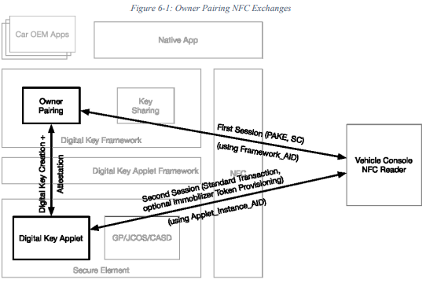

# 6 车主配对

#### 6.1 简介
新的所有者设备配对流或所有者设备更改并不意味着隐式取消配对，即新的设备所有者配对流只更改所有者的密钥。已经配对的现有共享/好友密钥和车辆公钥不一定会受到影响。
在所有者配对执行之前，数字密钥小程序实例应该在SE上可用。

标签7F4Ah不应包括车辆公钥证书（[K]）中提供的车辆标识符。如果提供了车辆标识符，则设备应将其与车辆叶片证书中提供的值进行比较，如果两者都不同，则中止车主配对。

最大命令数据长度应为239字节：
```
len = [command_data] + [padding] +[command_mac]

len = 239 + 1 + 8 ≦ 255 (ok)

len = 240 + 16 + 8 > 255 (not ok)
```
[command_data] + [padding]应是AES块大小（16字节）的倍数。填充方案在[9]中描述。至少需要一个字节填充（“80”）。最大响应数据长度应为239字节。

#### 6.2 密钥和数据
本节定义了所有者配对中使用的键和数据元素:
- device.PK/device.SK: 在数字密钥创建过程中由设备生成的长期密钥对。一个数码钥匙。
- vehicle.PK/vehicle.SK:由车辆生成的密钥对。车辆的所有数字钥匙也一样。此密钥对的生命周期由整车OEM定义和管理，超出了本规范的范围。
- Pairing password:输入到设备的SPAKE2+配对密码;由车辆OEM帐户提供的UTF-8格式的8位数字(0-9)，用于验证车主身份。
- Kenc:派生的对称密钥(来自SPAKE2+共享密钥)，用于加密机密命令有效载荷。
- Kmac:派生的对称密钥(来自SPAKE2+共享密钥)，用于计算命令mac。
- Krmac:派生的对称密钥(来自SPAKE2+共享密钥)，用于计算响应mac。

#### 6.3 所有者(车主)配对实现
所有者配对流程的各个阶段，包括:

1. Phase 0: 预配对，前置条件是device中已经安装了DK applet并且为每个vehicle OEM创建了对应的Instance CA(在车主配对前需要被创建)通过DK_FW获取到Instance CA。车端和device间的安全通道通过SPAKE2+协议创建。防止窃听和中间人攻击，在车端配对流程开始前，vehicle OEM服务器生成`Pairing password给到device，提供verifier和salt给到vehicle`
>DK_FW随着支持的OEM合作伙伴列表进行更新。OEM对应的Instance CA应该是在签署合作协议后。在后台生成和签名。然后下发到手机内（？？）----在得到人车绑定关系时，后台就会生成配对码，然后发送给TOBX

2. Phase 1: 在车辆和device中发起配对流程。车辆被用户设置为配对模式（在车内UI中，可选。需要手机端提供一个配对的UI。输入Pairing password，可以由用户输入，或者在安装了Vehicle OEM app的情况下，直接调用API输入。然后手机端会开启一个时钟，判断配对流程是否超时）或者是在没有车主设备配对成功时在NFC读卡器控制台上选择framework AID


3. Phase 2: 和NFC reader的第一次会话，由手机端的DK_FW执行。由两次NFC的近车通讯组成，第一次是协商协议版本（SPAKE2+协议版本/DK applet版本），由车端决定版本协商结果。不通过则会断开连接。执行SPAKE2+创建安全通道并且传输钥匙创建需要的数据给到device，车端发起select指令，device返回版本号。第二次会在device中已经创建DK后执行。提供钥匙创建证明和证书链给到车端。车端会读取钥匙数据并进行认证，成功后则会保存DPK。（DK_FW有不同的AID？？）
>在以SE为中心的应用实现模型中（比如通过APP也可以模拟CCC DK_FW），DK_FW可以在收到车端创建钥匙的必要数据后暂时不校验VPK，可以在Endpoint创建时去校验。同样对VPK的校验也有两种：①通过Vhehicle OEM CA证书去校验②通过Device OEM CA去校验。第二次会话不需要重新创建安全通道，直接使用之前计算得到的K/SK/CK进行通信



4. Phase 3: 和NFC reader的第二次会话，车辆配置车主device是否必须从车辆 OEM 服务器或车辆在线获取防盗认证token。如果配置了在线获取，车主防盗认证token不会在当前阶段通过NFC reader传输，而是在车主配对流程中或者配对后通过owner device OEM服务器向vehicle OEM服务器发起的Key Tracking请求/响应来传输
>此次会话成功后，车主device会发送一个异步的消息去注册车主钥匙到KTS（Key Track Request），不建议由车辆去发起，可能会产生竞争。如果车端也配置了需要发起Key Track Request。那么在车端先手袋Key Track Response时，不需要校验device收到的回复。

5. Phase 4: 配对流程结束，该步骤可选。主要是用于从车厂服务器/KTS中去获取immo token的场景
>如果不配置KTS，那么不需要此步骤。

所有者配对流由两个会话组成:第一个会话(阶段2)，使用第二个会话(阶段3)使用数字密钥小程序，如图6-1所示。在车主配对阶段2中，车辆配置了车主设备是否必须从车辆OEM服务器或车辆中在线检索制动令牌。如果配置了在线检索，则车主防盗令牌不会在与NFC阅读器的第二个会话中传输，而是在车辆的密钥跟踪请求/响应中传输
所有者之上的OEM服务器所有者配对期间或之后的设备OEM服务器。图6-1描述了从车辆中检索制动令牌的所有者配对过程。

第一个会话由两个NFC事务组成。第一个事务是协商协议版本，执行SPAKE2+，并将所有密钥创建数据传输到设备。第二个事务在设备中创建数字密钥后执行，为车辆提供创建认证和证书链。


